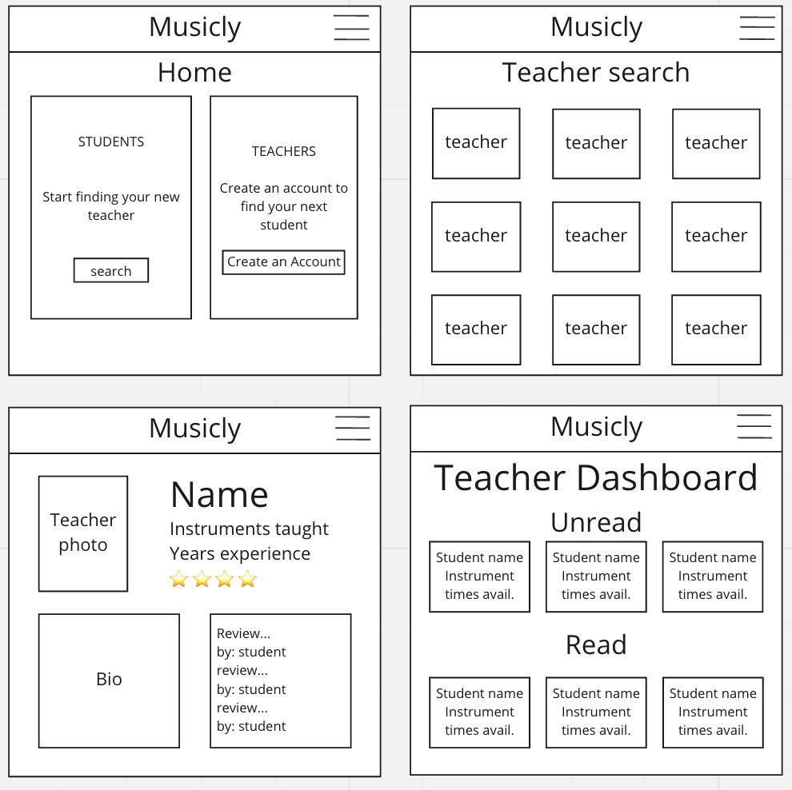
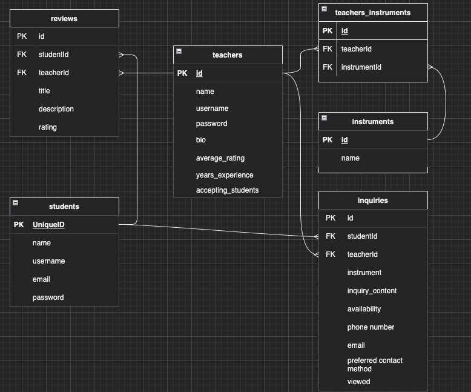

# Musicly

Musicly is a fullstack app connecting students to music teachers. Aspiring student musicians looking for remote musical education can find highly rated instructors for their instrument of choice and send inquiries for instruction. Music teachers are provided a platform to reach students anywhere in the world. 


# Tech Stack

* PostgreSQL
* Django
* React
* Axios
* Tailwind CSS
* Python
* Javascript

[Find the client repo here](https://github.com/waltersmatthew/musicly)

# The team

This app was designed and implemented by Ammon Orgill and Matthew Walters in a 5 day sprint.


# User Stories

As a student, I want to:
- Search for a teacher of my instrument of choice
- Read reviews and view the overall rating
- Send an inquiry to a teacher, provides availability, what they’re looking for
- Add/edit/delete a review/rating

As a teacher, I want to: 
- Create/edit a teacher account and profile
- View lesson inquiries, mark as "Seen", and sort inquiries accordingly

# App Flow
The app home page displays two sections, one for students to begin their music teacher search, one for teachers to signup or login. 

Students can begin their search by selecting their instrument of choice from a drop down menu. After selecting "Search," users are taken to a results page displaying teacher profile cards with their photo and high-level information, namely name, location, years of experience, and rating. Students can click on a profile card to view the teacher's full bio, including name, location, years of experience, rating, instruments they teach, and student reviews. Two buttons are located below the primary profile information, including on this page, including "Leave "Go back to search results", "Start a new search", and "Send inq"

Teachers can begin by selecting the "Signup" button which takes them to a form to input their name, username, and a password. After signing up, teachers are taken to another form where they can begin filling out their profile information (including all detail fields listed in above paragraph.) After submitting the form, teachers are taken to their Teacher Dashboard. Once they receive an inquiry, the inquiry card will be displayed. Teachers can sort their inquiries by "Viewed" or "New". Each inquiry card will have a button to mark the inquiry as "Viewed."

---

# Installation instructions

## Client installation

To run Musicly on your local machine, first fork and clone this repository. Then follow these steps:

* In your terminal, navigate to the cloned repository. Run the command ```npm -install```  or  ```npm i```
to install all of the packages needed to run the app.
 

* You're all set! run the command ```npm run start``` in your cloned repository and your client is ready to go.
* Make sure your server is running in order to create accounts and browse the website
* Enjoy!

## Server installation

* First set up a virtual environment in which to run the project
```
python3 -m venv .env
```
* Next, activate your virtual environment
```
source .env/bin/activate
```
* Once you are operating inside your virtual environment, you can run the command ```pip3 install -r requirements.txt``` to download the required dependencies for the server.
* Now you will need to create a sql database in order to use the project locally. 
    * In another terminal, run the command ```psql``` to enter the postgres shell
    * Then, to create the database, run ```CREATE DATABASE musiclydatabase```
* Once your database has been created, return to your project, and we will need to run migrations with the command ```python3 manage.py migrate```
* After that, your project should be ready to run!
* ```python3 manage.py runserver``` to get your server running
* Congratulations! If you navigate to ```localhost:8000``` you should see your django project running!
# Wireframes



---
# ERD



---
# RESTful Routing

### Students
| HTTP METHOD | URL (_Nouns_)       | CRUD | Response                                                    | Notes |
| ------------| -------------       | ---- | ----------------------------------------------------------  | ----- |
| POST        | /students           | C    | create new user                                             |       |
| POST        | /students/login     | C    | accept a payload of form data and use it to login a student |       |

### Teachers
| HTTP METHOD | URL (_Nouns_)       | CRUD | Response                                                    | Notes |
| ------------| -------------       | ---- | ----------------------------------------------------------  | ----- |
| POST        | /teachers           | C    | create new user                                             |       |
| GET         | /teachers/:id       | R    | show a specific teacher's profile                           |       |
| PUT         | /teachers/:id       | U    | edit a teacher's profile                                    |       |
| POST        | /teachers/login     | C    | accept a payload of form data and use it to login a teacher |       |

### Search
| HTTP METHOD | URL (_Nouns_)         | CRUD | Response                                                  | Notes |
| ------------| -------------         | ---- | --------------------------------------------------------- | ----- |
| GET         | /search/:instrumentId | R    | show a teacher's profile based on instrument id           |       |

### Inquiries
| HTTP METHOD | URL (_Nouns_)       | CRUD | Response                                                    | Notes |
| ------------| -------------       | ---- | ----------------------------------------------------------  | ----- |
| POST        | /inquiries          | C    | create a new inquiry                                        |       |
| GET         | /inquiries/:id      | R    | show an inquiry                                             |       |
| PUT         | /inquiries/:id      | U    | edit an inquiry                                             |       |

### Reviews
| HTTP METHOD | URL (_Nouns_)       | CRUD | Response                                                    | Notes |
| ------------| -------------       | ---- | ----------------------------------------------------------  | ----- |
| POST        | /reviews            | C    | create a new review                                         |       |
| GET         | /reviews/:id        | R    | show a review                                               |       |
| PUT         | /reviews/:id        | U    | edit a review                                               |       |
| DELETE      | /reviews/id         | D    | delete a review                                             |       |

---
# Sprint Breakdown

* Day one (Wednesday):
    * create databases 
    * stub out backend Django routes
* Day two (Thursday):
    * ensure data CRUD with Django admin profile
    * Stub out Next.js routes
* Day three (Friday):
    * Create front-end forms for lesson inquiries 
    * Create teacher dashboard/profile
    * Create rough partials for navbar/footer
* Day four (Saturday):
    * Finish up routing and ensure functionality on all pages
    * Get pages in rough layouts to match wireframes
* Day five (Sunday):
    * tweak CSS, ensure color/style cohesion
    * clean up code and deploy


# MVP
- Render a home page, search results page, teacher profile page, and teacher dashboard page
- Render sign up forms, login forms, and music teacher inquiry forms 
- Set up sequelize ORM models and tables
- Connect to backend server and databases using Django and RESTful routing principles
- Deployed online


# Stretch Goals
- Location-based search
- Students can create profile pages
- Option to send an email that opens up outlook
